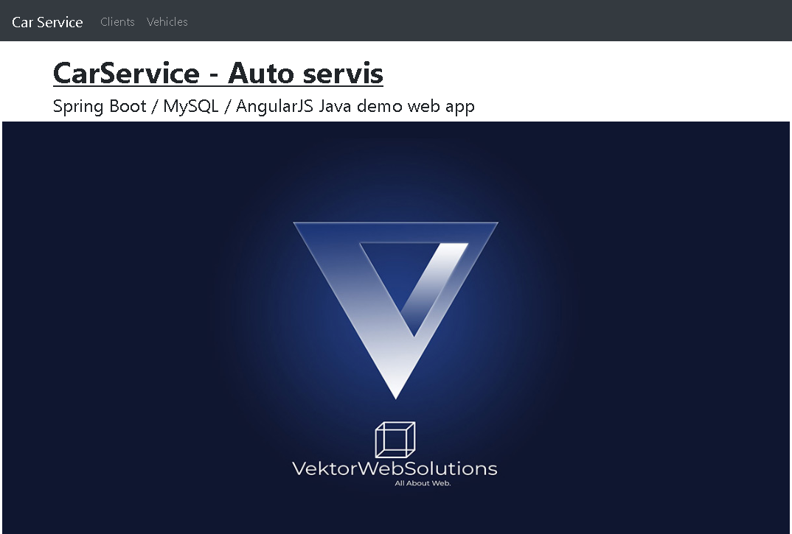
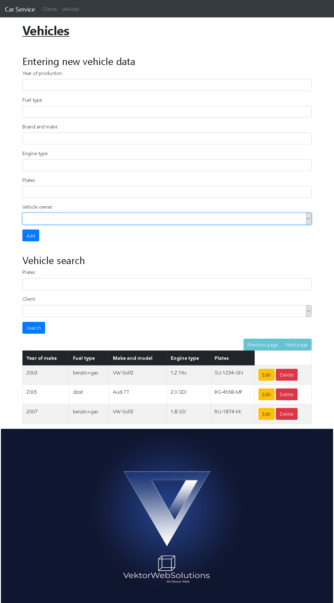

CarService v2.3 - Copyright (C)  Zeljko Stevanovic aka fluxmeister, 2020. All Rights Reserved.

SpringBoot/AngularJS webapp that handles with CarService entities, such are vehicles and customers.

REQUIREMENTS

	JRE

TESTED PLATFORMS

	Windows 

HISTORY
	v2.3	- translating to English started
	v2.2	- Heroku implementation
    v2.0    - Spring/Hibernate/AngularJS/MySQL webapp
    v1.5.1	- added RadniTermin (Work Term)
	v1.5.0	- added database support (MySQL)
    v1.2	- reading .xlsx files
	v1.1	- displaying work orders for a working term,
	v1.0	- first public release

LATEST VERSION

	Latest version is always available from:

	Sources (GIT)
		https://github.com/fluxmeister/carservice

fluxmeister <fluxmeister@hotmail.rs> <www.vektorwebsolutions.com>

10-August-2020
