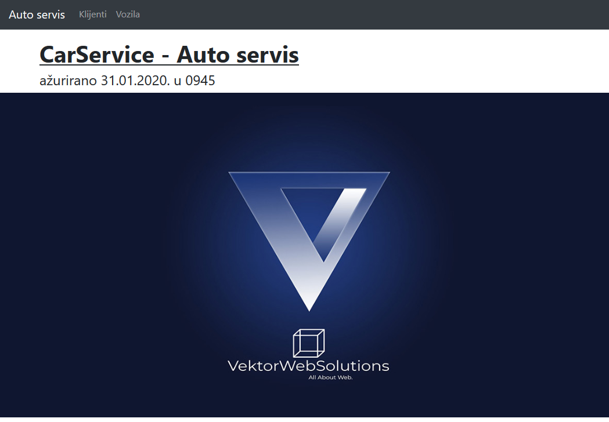
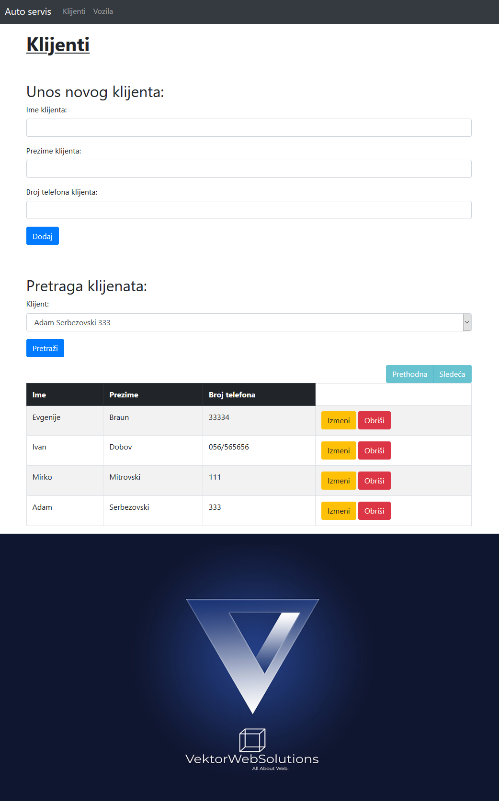
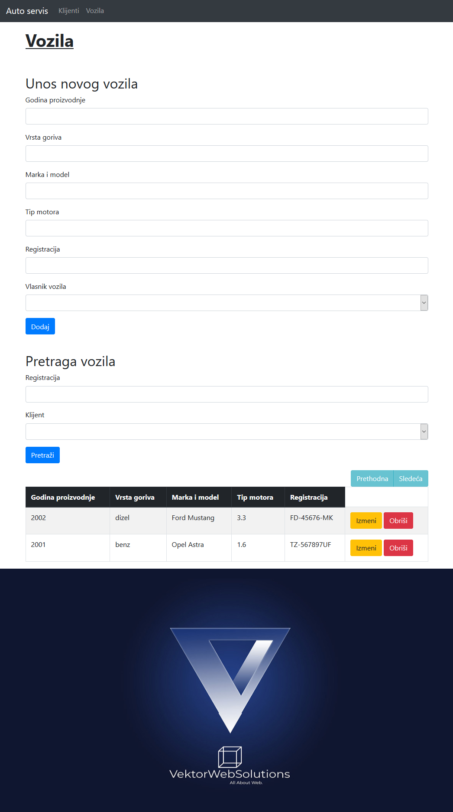

<<<<<<< HEAD
CarService v2.0 - Copyright (C)  Zeljko Stevanovic aka fluxmeister, 2020. All Rights Reserved.

SpringBoot/AngularJS webapp that handles with CarService entities, such are vehicles and customers. Work orders are expected for implementation in future.

=======
# carservice

CarService v2.2 - Copyright (C)  Zeljko Stevanovic aka fluxmeister, 2020. All Rights Reserved.

SpringBoot/AngularJS webapp that handles with CarService entities, such are vehicles and customers. 
Work orders are expected for implementation in the future.

>>>>>>> 20c565e46b93e1c7fdea01ec672c58c2f35ecf42
REQUIREMENTS

	JRE

TESTED PLATFORMS

	Windows 

HISTORY
<<<<<<< HEAD
    v2.0    - Spring/Hibernate/AngularJS/MySQL webapp
    v1.5.1	- added RadniTermin (Work Term)
	v1.5.0	- added database support (MySQL)
    v1.2	- reading .xlsx files
	v1.1	- displaying work orders for a working term,
	v1.0	- first public release
=======
    v2.2	- Heroku implementation
    v2.0    	- Spring/Hibernate/AngularJS/MySQL webapp
    v1.5.1	- added RadniTermin (Work Term)
    v1.5.0	- added database support (MySQL)
    v1.2	- reading .xlsx files
    v1.1	- displaying work orders for a working term,
    v1.0	- first public release
>>>>>>> 20c565e46b93e1c7fdea01ec672c58c2f35ecf42

LATEST VERSION

	Latest version is always available from:

	Sources (GIT)
		https://github.com/fluxmeister/carservice

<<<<<<< HEAD
fluxmeister <fluxmeister@hotmail.rs> <www.vektorwebsolutions.com>
=======
fluxmeister <zeljko@vektorwebsolutions.com> <www.vektorwebsolutions.com>
>>>>>>> 20c565e46b93e1c7fdea01ec672c58c2f35ecf42

31-January-2020
